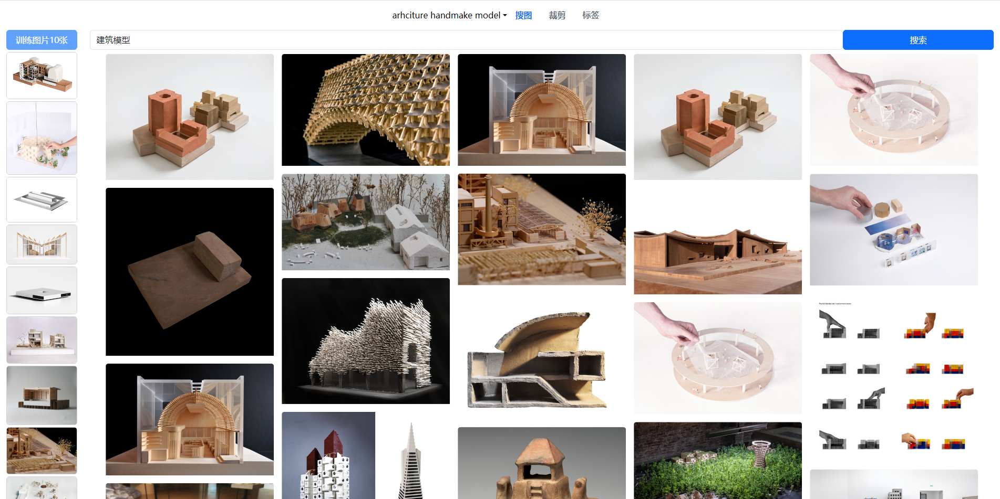
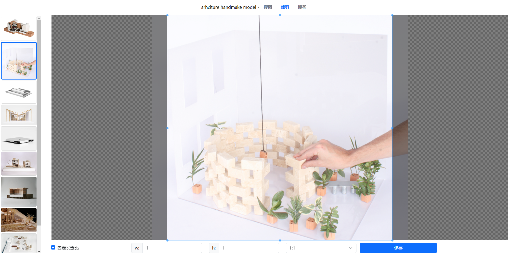
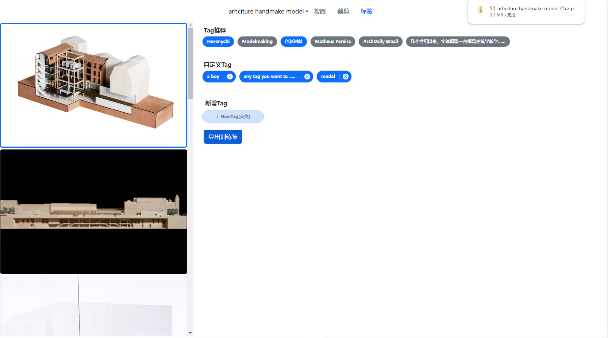

# SD Arch LoRA - 建筑 LoRA 模型训练工具包

SD Arch LoRA 是一个专为建筑领域设计的机器学习模型训练工具包，集成了从数据采集到模型训练的全流程功能。它支持用户通过内置爬虫工具自动采集数据，提供数据达标检查以确保训练质量，并包括高效的图像裁剪工具以优化模型输入。

## 功能特点

- **数据爬虫**: 自动从archidaily网站抓取建筑相关图片和数据。
- **达标检查**: 分析抓取的数据，确保其符合训练标准。
- **图像裁剪**: 自动裁剪和调整图像大小，以满足模型训练的需求。

## 软件截图

- **找图界面**
  
- **裁剪界面**
  
- **打标签界面**
  

## 开始使用

以下是如何在本地安装和运行 SD Arch LoRA 的简要指南：

### 先决条件

从Release页面下载安装包:

### 安装

双击打开下载下来的可执行文件
然后访问 http://127.0.0.1:8081